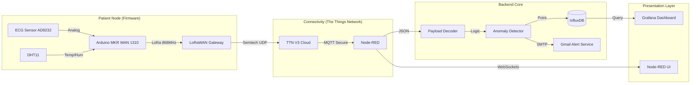

# 🫀 Connected Cardiac Surveillance System (IoT Holter Monitor)


## 📖 Executive Summary
The **Connected Cardiac Surveillance System** is a professional-grade IoT solution designed for remote patient monitoring. It functions as a real-time **Holter Monitor**, capable of transmitting Heart Rate (HR), Heart Rate Variability (HRV), and ECG waveforms over long distances using **LoRaWAN** technology.

The system is engineered to detect anomalies such as **Bradycardia**, **Tachycardia**, and high-stress levels automatically, alerting medical personnel via email with detailed reports. It features a robust backend for historical data analysis, allowing for long-term tracking of patient cardiac health without tethering them to a hospital bed.

---

## 🌟 Key Features

### 🩺 Real-Time Monitoring
- **Live ECG Streaming**: Continuous visualization of the ECG waveform.
- **Vital Signs**: Real-time display of Heart Rate (BPM) and Heart Rate Variability (HRV ms).
- **Status Indicators**: Instant visual feedback (Normal, Warning, Critical) with pulsing animations.

### 🧠 Intelligent Anomaly Detection
The system processes vital signs at the edge, classifying heart rhythm into 5 distinct categories:
- **🟢 Normal**: 60 - 100 BPM
- **🔵 Bradycardia**: 40 - 60 BPM (Warning)
- **🚨 Severe Bradycardia**: < 40 BPM (Critical)
- **⚠️ Tachycardia**: 100 - 150 BPM (Warning)
- **🔴 Severe Tachycardia**: > 150 BPM (Critical)

### 🔔 Smart Alerting System
- **State-Change Detection**: Prevents alert fatigue by triggering notifications only when the patient's condition changes (e.g., Normal → Tachycardia).
- **Rich Email Reports**: Sends HTML-formatted emails containing:
  - Severity Level (Info, Warning, Critical)
  - Snapshot of Vital Signs (HR, HRV, ECG value)
  - Exact Timestamp & Record ID
  - Patient/Device ID

### 📅 Historical Analysis
- **Data Retention**: Stores high-resolution medical data in **InfluxDB**.
- **Interactive Replay**: A sophisticated UI allows doctors to select past dates and review:
  - Daily Min/Max/Average Heart Rate.
  - HRV trends (Stress analysis).
  - Full playback of recorded ECG signals.

---

## 🏗 System Architecture

The project follows a modern IoT extraction-transformation-loading (ETL) pipeline:



### Hardware Stack
- **Microcontroller**: Arduino MKR WAN 1310 (Low power, secure LoRa connectivity).
- **Sensors**:
  - **AD8232** (Single-lead ECG front end).
  - **DHT11/22** (Environmental monitoring: Temp & Humidity).
- **Power**: LiPo Battery for mobile operation.

### Software Stack
- **Node-RED**: The central "brain". Handles MQTT ingestion, data processing, alert logic, and serves the primary medical dashboard.
- **InfluxDB**: Time-series database optimized for high-write loads of sensor data.
- **Grafana**: Secondary advanced visualization for infrastructure monitoring and long-term trend analysis.
- **Docker**: Fully containerized deployment for reliability and ease of installation.

---

## 📂 Repository Structure

```
heart-monitoring-system/
├── firmware/
│   └── lora_node/          # Arduino C++ Firmware for MKR WAN 1310
├── backend/
│   ├── node-red/           # Node-RED flows, credentials, and Dockerfile
│   │   ├── flows.json      # The core application logic and Dashboard UI
│   │   └── backups/        # Version controlled flow backups
│   ├── grafana/            # Grafana Dashboards & Provisioning configs
│   └── docker-compose.yml  # Container orchestration
└── docs/                   # Documentation and Project Reports
```

---

## 🚀 Getting Started

### Prerequisites
- **Docker Deployment**: Docker Desktop installed.
- **Hardware**: Arduino MKR WAN 1310.
- **Services**: A generic Gmail account (for alerts) and a The Things Network (TTN) account.

### 1. Backend Setup (Plug & Play)
The entire backend capabilities are pre-configured in Docker.
```bash
git clone https://github.com/Azeddinebelilita/Syst-me-connect-de-surveillance-cardiaque-ECG-.git
cd backend
docker-compose up -d
```
All services will launch automatically:
- **Node-RED Dashboard**: [http://localhost:1880/ui](http://localhost:1880/ui)
- **Node-RED Editor**: [http://localhost:1880](http://localhost:1880)
- **Grafana**: [http://localhost:3000](http://localhost:3000) (User: `admin` / Pwd: `admin`)
- **InfluxDB**: [http://localhost:8086](http://localhost:8086)

### 2. Firmware Configuration
1. Open `firmware/lora_node/lora_node.ino` in Arduino IDE.
2. Install the `MKRWAN` and `DHT` libraries.
3. Replace the `appEui` and `appKey` with your TTN Application credentials.
4. Flash the board.

### 3. Usage
1. Power on the device. It will join the LoRaWAN network via OTAA.
2. Open the **Node-RED Dashboard** (`/ui`).
3. You will see live "Waiting for data..." status.
4. Once packets arrive, the charts will animate, and the status badge will update in real-time.

---

## 🛡️ License
This project is open-source and available under the MIT License.

## 👥 Contributors
- Azeddine Belilita
- Youssef Derouiche
