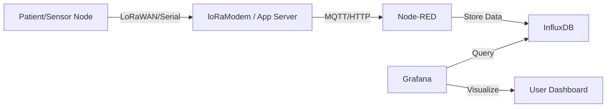

# Connected Cardiac Surveillance System (ECG)

## Overview
This project is a complete IoT solution for real-time cardiac monitoring (Holter system). It collects ECG and environmental data (Temperature, Humidity) using a LoRaWAN-connected Arduino MKR WAN 1310 node and visualizes it through a containerized backend stack using Node-RED, InfluxDB, and Grafana.

## 🏗 Architecture



## 📂 Repository Structure

```
.
├── firmware/           # Arduino/C++ code for the LoRa Node
│   └── lora_node/      # MKR WAN 1310 Firmware
├── backend/            # Dockerized backend services
│   ├── node-red/       # Flows and configurations
│   ├── grafana/        # Dashboards and provisioning
│   └── docker-compose.yml
└── docs/               # Project documentation and reports
```

## 🚀 Getting Started

### Prerequisites
- **Docker & Docker Compose** (for the backend)
- **Arduino IDE** (to flash the firmware)
- **MKR WAN 1310** board (or compatible LoRa node)

### 1. Firmware Setup
1. Open `firmware/lora_node/lora_node.ino` in Arduino IDE.
2. Install the required libraries:
   - `MKRWAN`
   - `DHT sensor library`
3. Update the `appEui` and `appKey` variables with your LoRaWAN credentials.
4. Upload the code to your board.

### 2. Backend Deployment
Navigate to the backend directory and start the services:

```bash
cd backend
docker-compose up -d
```

### 3. Accessing the Dashboards
- **Node-RED**: [http://localhost:1880](http://localhost:1880)
- **Grafana**: [http://localhost:3000](http://localhost:3000) (Default login: `admin` / `admin`)

## 🛠 Tech Stack
- **Hardware**: Arduino MKR WAN 1310, DHT11 Sensor
- **Connectivity**: LoRaWAN (EU868)
- **Backend**:
  - **Node-RED**: Flow-based programming for data processing.
  - **InfluxDB**: Time-series database for heart rate and environmental data.
  - **Grafana**: Advanced visualization and alerting.

## 📄 License
This project is open-source.
